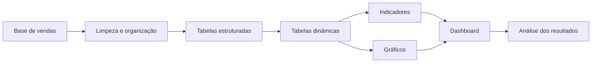

<div align="center">

# 📊 Dashboard de Vendas — Xbox Game Pass

Dashboard desenvolvido no Microsoft Excel para organizar, analisar e visualizar dados relacionados às vendas de assinaturas e produtos do ecossistema Xbox Game Pass.


</div>

---

## 📌 Sobre o projeto

Este projeto apresenta um dashboard desenvolvido no Microsoft Excel para transformar uma base de vendas em informações visuais mais fáceis de interpretar.

A proposta é organizar dados relacionados ao Xbox Game Pass e apresentar indicadores capazes de apoiar análises como:

* volume de vendas;
* faturamento;
* comportamento das assinaturas;
* desempenho por período;
* distribuição por produto;
* comparação entre categorias;
* evolução dos resultados.

O projeto foi desenvolvido durante estudos de Excel, análise de dados e inteligência artificial na Digital Innovation One — DIO.

> O arquivo Excel é a aplicação principal deste repositório. Não existe uma aplicação web, API ou banco de dados implementado.

---

## 🎯 Objetivos

Os principais objetivos do projeto são:

* praticar análise de dados com Excel;
* transformar dados brutos em indicadores;
* criar visualizações gerenciais;
* utilizar tabelas dinâmicas;
* aplicar segmentações de dados;
* organizar métricas de vendas;
* melhorar a apresentação das informações;
* apoiar a tomada de decisão;
* desenvolver um projeto de portfólio em análise de dados.

---

## 📊 Arquivo principal

```text
Dashboard Vendas Xbox GamePass.xlsx
```

A planilha contém a base e os elementos utilizados para construir o dashboard.

Dependendo da estrutura interna do arquivo, ela pode incluir:

* base de dados;
* tabelas auxiliares;
* tabelas dinâmicas;
* indicadores;
* gráficos;
* segmentações;
* painel principal.

---

## 📈 Indicadores possíveis

Um dashboard de vendas pode apresentar indicadores como:

| Indicador               | Descrição                            |
| ----------------------- | ------------------------------------ |
| Faturamento total       | Soma dos valores vendidos            |
| Total de vendas         | Quantidade de transações             |
| Ticket médio            | Valor médio por venda                |
| Assinaturas vendidas    | Total de assinaturas comercializadas |
| Receita por produto     | Faturamento por tipo de assinatura   |
| Receita por período     | Evolução mensal ou anual             |
| Produto mais vendido    | Item com maior quantidade            |
| Participação percentual | Representatividade de cada categoria |

> Apenas os indicadores efetivamente presentes na planilha devem ser apresentados como funcionalidades concluídas.

---

## 🧮 Exemplos de cálculos

### Faturamento total

```text
Faturamento total = soma dos valores das vendas
```

No Excel:

```excel
=SOMA(intervalo_de_vendas)
```

---

### Ticket médio

```text
Ticket médio = faturamento total ÷ quantidade de vendas
```

Exemplo:

```excel
=SOMA(intervalo_de_vendas)/CONT.NÚM(intervalo_de_vendas)
```

---

### Quantidade de vendas

```excel
=CONT.NÚM(intervalo_de_vendas)
```

---

### Vendas por categoria

```excel
=SOMASES(
    intervalo_valores;
    intervalo_categorias;
    categoria_selecionada
)
```

---

## 🔄 Fluxo de análise



---

## 🛠️ Tecnologias e recursos

| Tecnologia ou recurso | Aplicação                       |
| --------------------- | ------------------------------- |
| Microsoft Excel       | Construção do dashboard         |
| Tabelas               | Organização dos dados           |
| Tabelas dinâmicas     | Consolidação das informações    |
| Gráficos              | Visualização dos resultados     |
| Segmentação de dados  | Filtros interativos             |
| Fórmulas              | Cálculos e indicadores          |
| GitHub                | Armazenamento e documentação    |
| IA generativa         | Apoio durante o desenvolvimento |

---

## 🤖 Uso de inteligência artificial

Ferramentas de IA podem ter sido utilizadas como apoio para:

* sugerir fórmulas;
* explicar funções do Excel;
* ajudar na limpeza dos dados;
* recomendar gráficos;
* revisar indicadores;
* organizar o layout;
* documentar o projeto.

A IA atua como ferramenta de suporte. A validação dos cálculos e das informações continua sendo responsabilidade de quem desenvolve a análise.

---

## 📁 Estrutura do repositório

```text
Dashboard-vendas/
│
├── Dashboard Vendas Xbox GamePass.xlsx
└── README.md
```

| Arquivo                               | Descrição                   |
| ------------------------------------- | --------------------------- |
| `Dashboard Vendas Xbox GamePass.xlsx` | Dashboard e base de análise |
| `README.md`                           | Documentação do projeto     |

---

## 🚀 Como visualizar

### 1. Clone o repositório

```bash
git clone https://github.com/ONestoDev/Dashboard-vendas.git
```

### 2. Acesse a pasta

```bash
cd Dashboard-vendas
```

### 3. Abra a planilha

Abra o arquivo:

```text
Dashboard Vendas Xbox GamePass.xlsx
```

Utilize preferencialmente o Microsoft Excel.

Também é possível tentar abrir com:

* LibreOffice Calc;
* Google Planilhas, após importação.

> Tabelas dinâmicas, segmentações, gráficos e formatações podem funcionar de maneira diferente fora do Microsoft Excel.

---

## 🖱️ Como interagir com o dashboard

Caso o arquivo possua segmentações e filtros:

1. abra a aba do dashboard;
2. selecione um período;
3. escolha uma categoria ou produto;
4. observe a atualização dos gráficos;
5. utilize a opção de limpar filtro para retornar à visão geral.

---

## ✅ Boas práticas adotadas

Um dashboard bem estruturado deve priorizar:

* leitura rápida;
* indicadores relevantes;
* cores consistentes;
* números formatados;
* filtros objetivos;
* gráficos adequados;
* ausência de poluição visual;
* separação entre base e painel;
* títulos claros;
* atualização simples.

---

## ⚠️ Limitações

O projeto possui algumas limitações comuns a dashboards em planilhas:

* depende do Microsoft Excel;
* pode exigir atualização manual;
* não possui banco de dados;
* não possui atualização em tempo real;
* pode apresentar incompatibilidade em outros editores;
* não possui controle de acesso;
* não possui histórico automatizado;
* fórmulas podem ser alteradas acidentalmente;
* não há testes automatizados;
* o conteúdo interno não está documentado em arquivos de texto.

---

## 🔐 Privacidade dos dados

Bases de vendas podem conter informações sensíveis.

Não publique:

* nomes completos de clientes;
* documentos;
* endereços;
* telefones;
* e-mails;
* dados bancários;
* números de cartões;
* informações comerciais confidenciais.

Para projetos de portfólio, utilize dados fictícios, anonimizados ou públicos.

---

## 🗺️ Melhorias futuras

O projeto poderá evoluir com:

* documentação das abas;
* dicionário de dados;
* descrição das fórmulas;
* proteção das células;
* botão de atualização;
* tratamento com Power Query;
* criação de medidas;
* comparação entre períodos;
* metas de vendas;
* análise de crescimento;
* exportação em PDF;
* publicação no Power BI;
* atualização automática;
* inclusão de capturas do dashboard no README.

---

## 📖 Dicionário de dados sugerido

| Campo          | Descrição                     |
| -------------- | ----------------------------- |
| Data           | Data da venda                 |
| Produto        | Tipo de produto ou assinatura |
| Categoria      | Classificação do produto      |
| Quantidade     | Unidades vendidas             |
| Valor unitário | Preço por unidade             |
| Valor total    | Resultado da venda            |
| Região         | Localização da venda          |
| Canal          | Origem da venda               |

A estrutura real deve ser atualizada conforme as colunas existentes na planilha.

---

## 🧪 Validações recomendadas

Antes de analisar os resultados, verifique:

* valores duplicados;
* datas inválidas;
* células vazias;
* preços negativos;
* categorias inconsistentes;
* fórmulas quebradas;
* intervalos incompletos;
* filtros ativos;
* atualização das tabelas dinâmicas.

---

## 📚 Aprendizados desenvolvidos

Durante o projeto podem ter sido praticados:

* Excel;
* análise de dados;
* organização de bases;
* tabelas;
* tabelas dinâmicas;
* segmentação;
* indicadores;
* gráficos;
* fórmulas;
* design de dashboards;
* comunicação visual;
* inteligência artificial aplicada à produtividade.

---

## 🎓 Contexto educacional

Projeto desenvolvido durante estudos de análise de dados e Excel na Digital Innovation One — DIO.

O dashboard possui finalidade educacional e demonstra a transformação de dados de vendas em informações visuais.

---

## 👨‍💻 Autor

Desenvolvido por **Ernesto — ONestoDev**.

[](https://github.com/ONestoDev)

---

## 📄 Licença

O projeto ainda não possui uma licença definida.

Adicione um arquivo `LICENSE` para esclarecer as condições de uso, modificação e distribuição.
